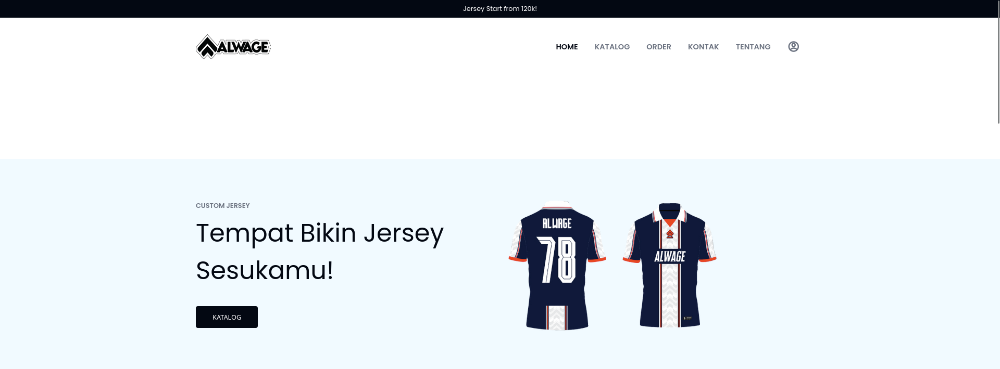
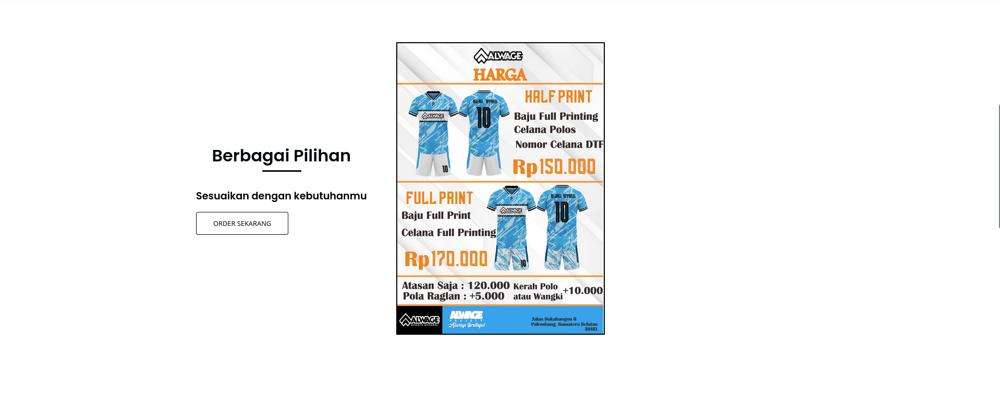
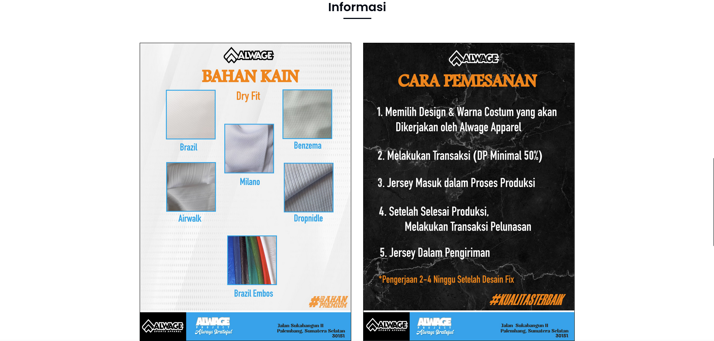
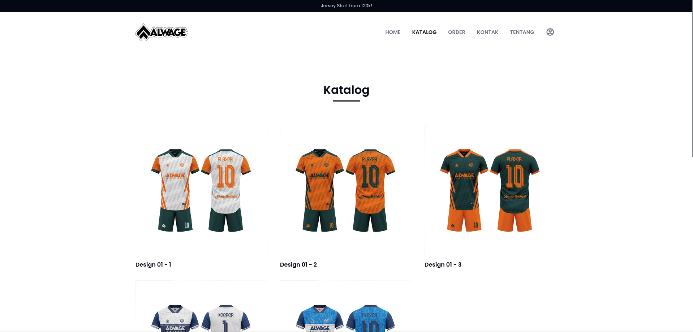
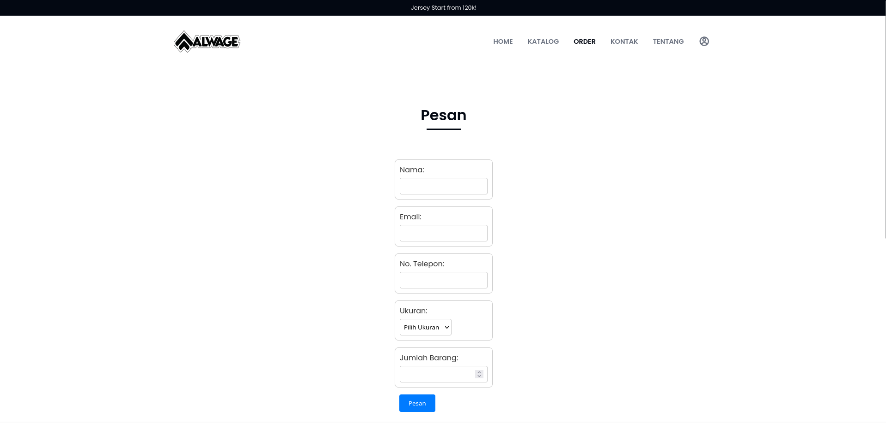
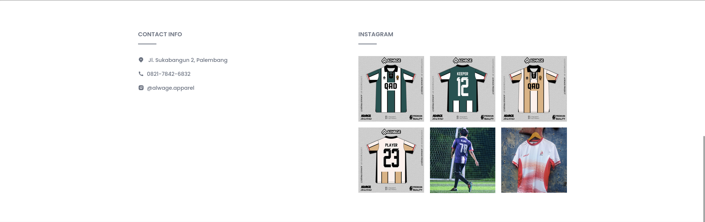

# Alwage Apparel Website

A simple responsive website for Alwage Apparel, a custom jersey and apparel manufacturer. This site provides information about products, ordering steps, catalogs, and contact info.

## Features

- Responsive navigation bar with mobile support
- Product catalog with images
- Informational articles about materials and ordering process
- Instagram gallery preview
- Contact information and links

## Folder Structure

- **index.html**: Main landing page
- **styles.css**: Main stylesheet
- **js/**: JavaScript files for interactivity
- **assets/**: Images used throughout the site
- **documents/**: Additional pages (catalog, about, order, etc.)
- **favicon/**: Favicon and manifest files
- **screenshots/**: Screenshots of the website for preview

## Preview

Below are screenshots of the website:

<!-- Screenshots preview -->

## Getting Started

1. Clone or download this repository.
2. Open `index.html` in your browser to view the site locally.

## Customization

- Update images in the `assets/` folder as needed.
- Edit content in `documents/` for catalog, about, and order pages.
- Modify styles in `styles.css` for branding.

## License

This project is for educational and demonstration purposes.
